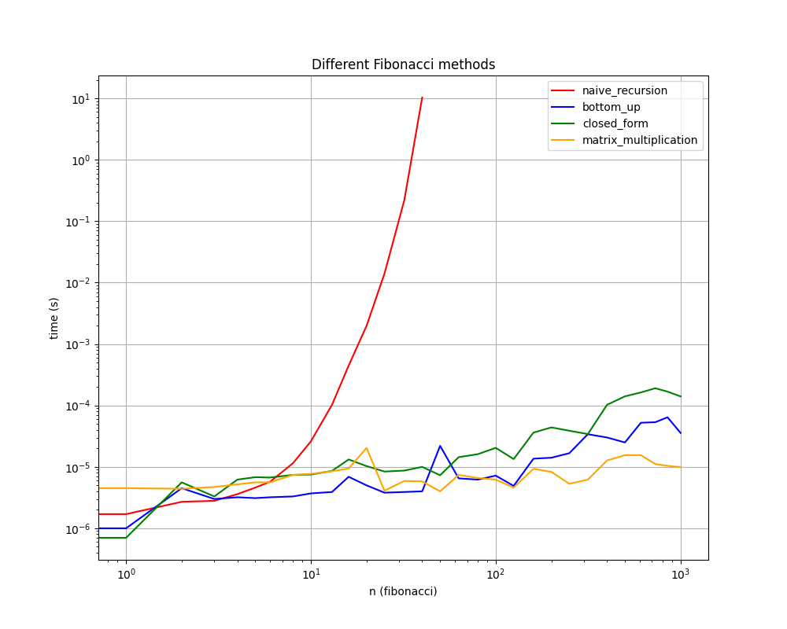

#   Fibonacci Sequence: Algorithm Optimization & Analysis

This folder explores one of the most famous mathematical sequences in computer science: the Fibonacci sequence. The goal of this project is to implement four progressively optimized algorithms to compute the $n$-th Fibonacci number, benchmark their real-world execution times, and analyze their asymptotic complexities.

##  The Four Approaches

### 1. Naive Recursive (The Brute Force)
* **Approach:** Directly translates the mathematical definition $F_n = F_{n-1} + F_{n-2}$ into code.
* **Time Complexity:** $\Omega(2^{n/2})$ (Exponential)
* **Analysis:** Highly inefficient. It recalculates the same subproblems repeatedly, creating a massive recursion tree. It becomes unrunnable for $n > 40$.

### 2. Bottom-Up / Iterative (The Practical Choice)
* **Approach:** Computes the sequence iteratively from the ground up, storing only the previous two values in memory to calculate the next one.
* **Time Complexity:** $\Theta(n)$ (Linear)
* **Analysis:** Extremely fast and memory-efficient for everyday use. Easily handles $n = 1000$ very efficiently.

### 3. Closed-Form / Binet's Formula (The Mathematical Shortcut)
* **Approach:** Uses the Golden Ratio ($\Phi$) and floating-point arithmetic to compute the answer directly using the formula $F_n = \text{round}(\Phi^n / \sqrt{5})$.
* **Time Complexity:** $\Theta(\log n)$ (due to exponentiation under the hood)
* **Analysis:** While fast on paper, this method introduces a critical engineering flaw: **floating-point precision loss**. As $n$ grows large, floating-point limitations cause rounding errors, meaning it returns the *wrong* Fibonacci number for large inputs. 

### 4. Matrix Multiplication (The Optimal Scaling Solution)
* **Approach:** Represents the sequence as a $2 \times 2$ matrix $$\begin{bmatrix} 1 & 1 \\ 1 & 0 \end{bmatrix}$$ and uses **exponentiation by squaring** to compute the $n$-th power.
* **Time Complexity:** $\Theta(\log n)$ (Logarithmic)
* **Analysis:** It is the ultimate solution for massive inputs. It avoids floating-point errors by strictly using integer arithmetic while maintaining logarithmic speed.

---

##  Performance Benchmarking

To prove these theoretical time complexities, I wrote a benchmarking script that samples the running times of all four methods for increasing values of $n$. The script includes a hard timeout of 3.0 seconds to automatically kill methods once they exceed a reasonable execution time.

###  Interpreting the Data

The line plot above (plotted on a logarithmic scale) perfectly visualizes the mathematical theory:
* **The Exponential Wall:** The naive recursive method (red line) violently curves upward and times out almost immediately. On a log-log plot, an exponential curve perfectly confirms its $\Omega(2^{n/2})$ bounds.
* **The Linear Slope:** The bottom-up method (blue line) displays as a steady, upward-sloping diagonal line, which represents polynomial/linear growth on a logarithmic scale. 
* **The Logarithmic Flatline:** The matrix multiplication method (orange line) remains almost completely flat at the bottom of the graph. Even as $n$ approaches 1000, the execution time barely increases, proving the extreme efficiency of $\Theta(\log n)$ scaling.